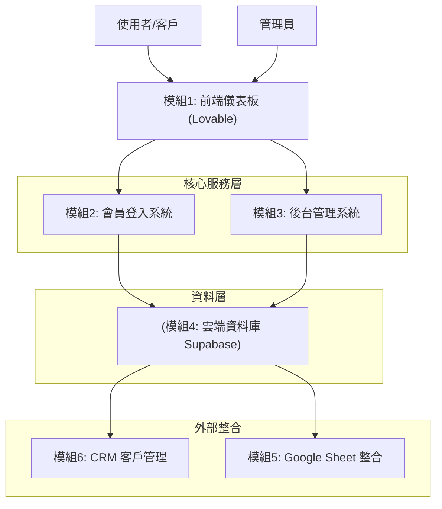

# 🏗️ 模組0: 架構設計文件

## 1️⃣ 第一性原理拆解

**核心知識點：系統架構設計 (System Architecture)**

```
最根本的問題：
「怎麼把複雜系統拆解成可管理的模組？」

生活類比：
├─ 樂高積木：獨立積木組合成完整作品→模組化設計
├─ 餐廳分工：廚師、服務生、收銀各司其職→職責分離
└─ 城市規劃：住宅區、商業區、工業區分開→分層架構

軟體中的實現：
分層架構 + 模組化 + 定義清楚的介面 = 可維護的系統
```

**拆解成4個子問題：**
1. **分層設計**：「系統要分成哪幾層？各層職責是什麼？」
2. **模組拆分**：「功能要怎麼分成獨立積木？」
3. **資料流動**：「資料在模組間如何傳遞？」
4. **技術選型**：「每個模組用什麼技術實現？」

---

## 2️⃣ 模組設計

### 設計目標
建立完整的 B2B 訂單管理系統，透過模組化開發方式，確保系統可維護、可擴展。

### 核心價值
| 原則 | 說明 |
|------|------|
| **思維優先** | 先懂概念，再用 AI 實現 |
| **模組化設計** | 將複雜系統拆解成獨立積木 |
| **文件驅動** | 記錄設計思路，確保可維護性 (SDD) |
| **迭代開發** | 先跑起來，再逐步完善 |

### 系統架構圖



### 系統架構總覽

```
┌───────────────────────────────────────────────┐
│         🌐 前端儀表板 (Lovable)              │
│    (學員看到的介面:下單、查訂單)             │
└─────────────┬─────────────────────────────────┘
              ↓ 資料流動
┌─────────────────────────────────────────────────┐
│    🔐 會員登入 + 🎛️ 後台管理                    │
│    (誰能做什麼:權限控制的中樞)                 │
└──────────┬──────────────────────────────────────┘
           ↓ 存取資料
┌──────────────────────────────────────────────────┐
│         💾 雲端資料庫 (Supabase)                 │
│    (所有資料的家:訂單、會員、商品)              │
└──────┬───────────────────────────┬───────────────┘
       ↓                           ↓
┌──────────────┐           ┌──────────────────┐
│ 📊 Google    │           │ 🤝 CRM 客戶      │
│    Sheet     │           │    管理系統      │
│  (對帳報表)  │           │  (客戶互動紀錄)  │
└──────────────┘           └──────────────────┘
```

### 技術棧

| 技術層 | 使用工具/技術 | 用途 |
|-------|-------------|------|
| **前端** | Lovable (React + TypeScript) | 客戶與管理介面 |
| **後端API** | Python (FastAPI) | 核心業務邏輯與 API 服務 |
| **資料庫** | Supabase (PostgreSQL) | 資料儲存與身份驗證基礎 |
| **身份驗證** | Supabase Auth + JWT | 會員註冊、登入與權限管理 |
| **API整合** | Google Sheets API | 報表匯出與資料同步 |
| **CRM** | Python | 客戶管理邏輯 |
| **排程** | Python APScheduler | 定時任務 |
| **套件管理** | uv | 高效 Python 套件管理器 |

### 六大核心模組

| 模組 | 核心功能 | 關鍵機制 | 技術重點 |
|------|---------|---------|---------|
| **模組1** | 使用者介面 (UI/UX) | 響應式介面、即時數據展示、表單互動 | React Components |
| **模組2** | 身份驗證 (Authentication) | 註冊、登入 (JWT)、登出、權限判定 | 密碼加密 (bcrypt)、Token 管理、API 串接 |
| **模組3** | 權限管理 (Authorization) | 商品 CRUD、訂單管理、角色權限中介層 | API 路由設計、資料庫操作封裝、API 串接 |
| **模組4** | 資料建模 (Data Modeling) | Schema 設計、關聯建立 (PK/FK)、資料完整性 | PostgreSQL、Supabase |
| **模組5** | 第三方 API 整合 | 自動化報表、資料同步 | Google Cloud、OAuth 認證 |
| **模組6** | 業務邏輯 (Business Logic) | 客戶分群、互動追蹤、自動化規則 | 複雜查詢、定時任務 |

### 資料庫 ER 圖

```
┌──────────────┐         ┌──────────────┐         ┌──────────────┐
│   使用者     │         │    訂單      │         │    商品      │
├──────────────┤         ├──────────────┤         ├──────────────┤
│ id (PK)      │1       ∞│ id (PK)      │        ∞│ id (PK)      │
│ username     ├─────────│ user_id (FK) │         │ name         │
│ email        │         │ order_date   │         │ price        │
│ role         │         │ status       │         │ stock        │
│ created_at   │         │ total_amount │         │ category     │
└──────────────┘         └──────┬───────┘         └──────┬───────┘
                                │                        │
                                │ ∞                     1│
                         ┌──────┴────────┐              │
                         │  訂單明細     │              │
                         ├───────────────┤              │
                         │ id (PK)       │              │
                         │ order_id (FK) ├──────────────┘
                         │ product_id (FK)
                         │ quantity      │
                         │ price         │
                         └───────────────┘
```

### 建議專案結構

```
OrderFlow/
├── frontend/           # 模組1: Lovable React 專案
├── backend/            # Python FastAPI 後端
│   ├── auth/           # 模組2: 認證相關
│   ├── admin/          # 模組3: 後台管理相關
│   ├── crm/            # 模組6: CRM 邏輯
│   ├── database.py     # 模組4: 資料庫連線
│   └── main.py         # 程式進入點
├── scripts/            # 工具腳本
│   └── sync_sheets.py  # 模組5: Google Sheet 同步
├── docs/               # 專案文件
├── config/             # 設定檔
├── logs/               # 日誌檔案
├── pyproject.toml      # uv 套件管理設定檔
└── README.md           # 專案啟動說明文件
```

### 可維護性設計

| 維度 | 設計要點 |
|------|---------|
| **模組化** | 每個模組獨立開發、獨立測試 |
| **擴展性** | 預留介面層，方便新增功能 |
| **可讀性** | 統一文件格式，清楚的命名規範 |

---

## 3️⃣ AI 協作開發提示詞

### Vibe Coding 開發原則

| 原則 | 說明 |
|------|------|
| **Context (背景脈絡)** | 清楚告訴 AI 你的角色與專案目標 |
| **Task (具體任務)** | 明確定義要完成的功能點 |
| **Format (輸出格式)** | 指定程式碼結構、檔案命名與特定規範 |
| **Example (範例參考)** | 提供類似的程式碼或邏輯供 AI 模仿 |

### 完整 Prompt 範本

```markdown
# OrderFlow 系統架構建置

## 背景說明
我正在建立一個 B2B 訂單管理系統，採用模組化架構設計。

## 專案目標
- 客戶能夠下單、查詢訂單
- 管理員能夠管理訂單、商品、使用者
- 自動產生週報表到 Google Sheet
- CRM 追蹤客戶互動

## 技術棧
- 前端：Lovable (React)
- 後端：Python FastAPI
- 資料庫：Supabase (PostgreSQL)
- 套件管理：uv
- 外部整合：Google Sheets API

## 需要建立的檔案結構
OrderFlow/
├── frontend/           # 模組1: Lovable React 專案
├── backend/            # Python FastAPI 後端
│   ├── auth/           # 模組2: 認證相關
│   ├── admin/          # 模組3: 後台管理相關
│   ├── crm/            # 模組6: CRM 邏輯
│   ├── database.py     # 模組4: 資料庫連線
│   └── main.py         # 程式進入點
├── scripts/            # 工具腳本
│   └── sync_sheets.py  # 模組5: Google Sheet 同步
├── docs/               # 專案文件
├── config/             # 設定檔
├── logs/               # 日誌檔案
├── pyproject.toml      # uv 套件管理設定檔
└── README.md           # 專案啟動說明文件

## 各模組功能概述
- 模組2：會員登入（註冊、登入、登出）
- 模組3：後台管理（訂單、商品、使用者管理）
- 模組1：前端儀表板（客戶介面）
- 模組4：資料庫（Supabase 建表）
- 模組5：Google Sheet 整合（週報表）
- 模組6：CRM（客戶追蹤）

請幫我建立這個專案的基礎架構，並完全使用 `uv` 進行套件管理（不要使用 pip 或 requirements.txt），包含：
1. 使用 `uv init` 初始化專案，產生 `pyproject.toml`
2. 後端 main.py 進入點
3. 資料庫連線設定
4. 各模組的空目錄結構與 __init__.py
5. 建立 `README.md`，詳細說明如何使用 `uv sync` 安裝依賴與 `uv run` 啟動專案

先建立骨架，各模組功能會分開開發。
```

### 模組開發順序建議

```markdown
請依照以下順序開發各模組：

第一階段：基礎建設
1. 模組0：架構設計 → 系統整體規劃與技術選型
2. 模組2：會員登入 → 身份驗證機制

第二階段：核心功能
3. 模組3：後台管理 → 管理介面
4. 模組1：前端儀表板 → 客戶介面
5. 模組4：資料庫 → 訂單管理系統資料表結構

第三階段：進階功能
6. 模組5：Google Sheet → 報表整合
7. 模組6：CRM → 客戶管理

每個模組開發完成後，進行整合測試再進入下一個模組。
```

---

## 4️⃣ 手動功能測試說明

### 測試標的
驗證 AI 是否正確生成專案骨架與基礎架構。

### 測試環境準備
1. 確認 Python 環境 (建議 3.9+)
2. 準備 Supabase URL 與 Key (若尚未設定，可先檢查檔案是否生成)

### 測試案例清單

| 編號 | 測試項目 | 測試步驟 | 預期結果 |
|------|---------|---------|---------|
| T01 | 目錄結構檢查 | 檢查專案根目錄 | 應包含 `backend`, `frontend`, `scripts` 等資料夾 |
| T02 | 模組結構檢查 | 檢查 `backend/` 內各模組資料夾 | 各模組 (auth, admin, crm...) 資料夾內皆有 `__init__.py` |
| T03 | 後端啟動測試 | 執行 `uv run uvicorn backend.main:app --reload` | 終端機顯示 FastAPI 啟動成功訊息 |
| T04 | 資料庫設定檢查 | 檢查 `backend/database.py` | 檔案存在且包含 Supabase 連線程式碼 |

### 異常排除
- 若 `main.py` 啟動失敗，檢查 `pyproject.toml` 是否有被生成並安裝 (FastAPI, Uvicorn)。
- 若目錄缺失，請讓 AI 重新生成一次，並強調「完整的目錄結構」。
